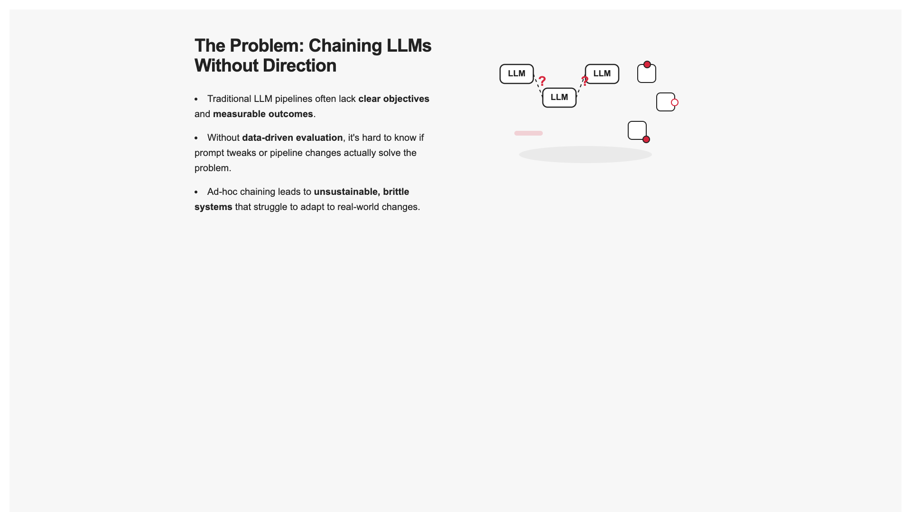
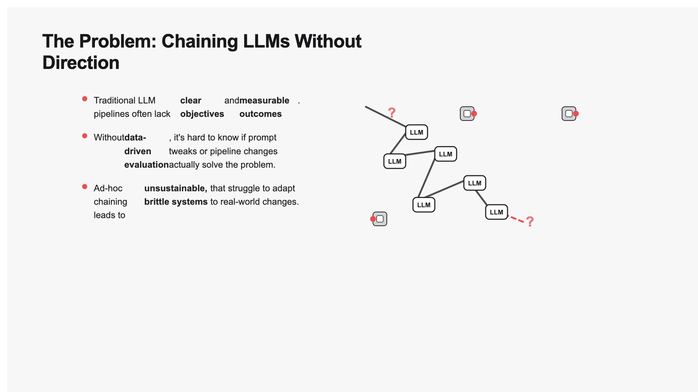
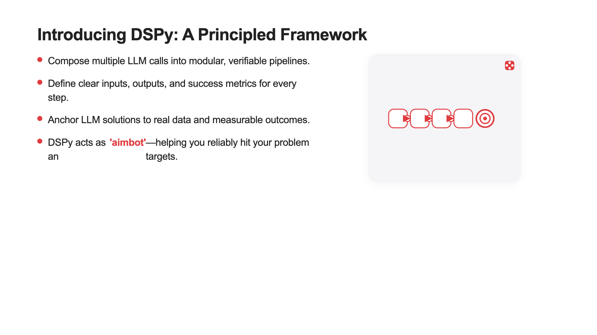
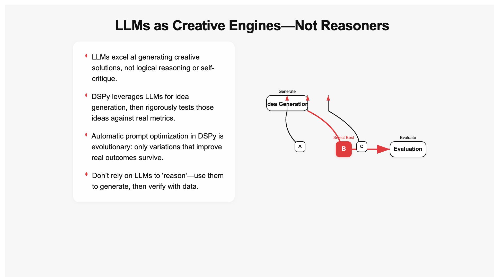
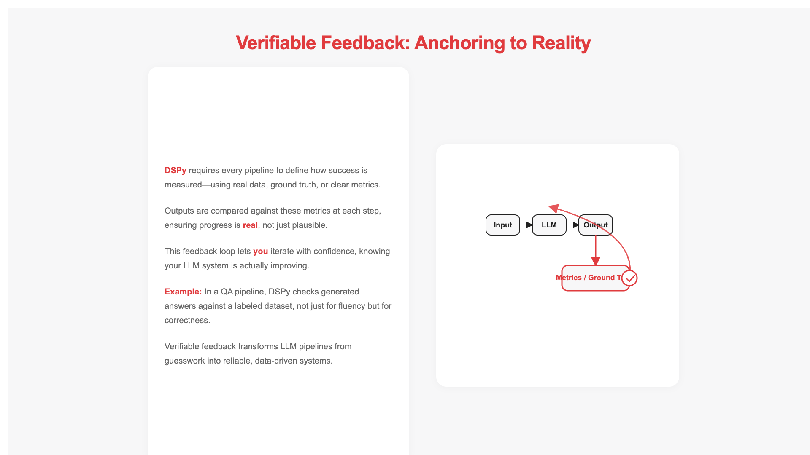
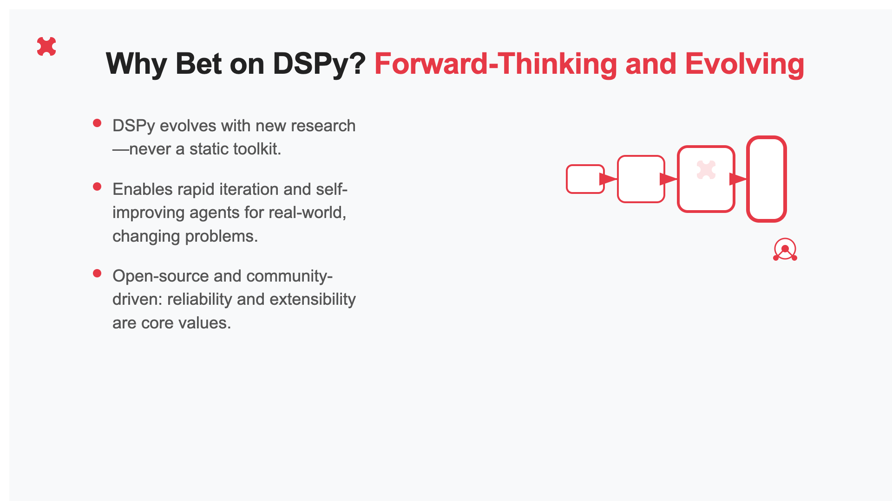
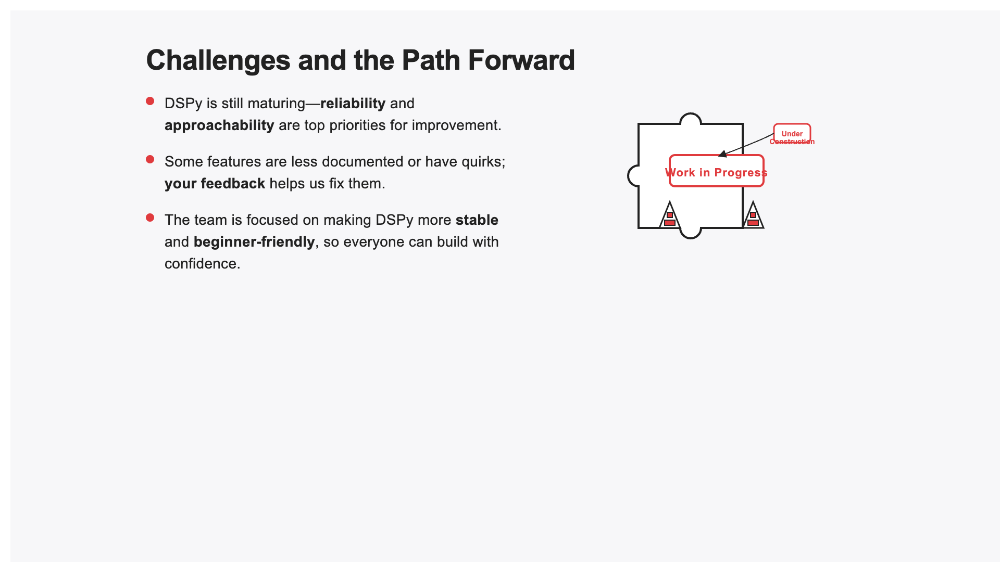
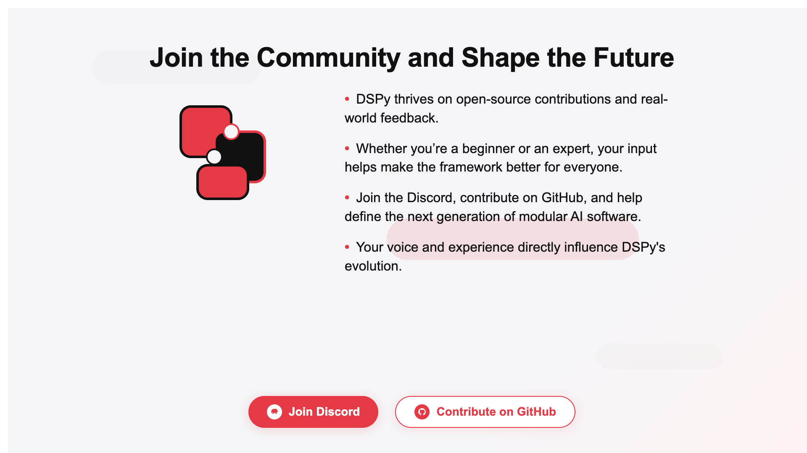

## DSPy Dev Blog -- Recreating Ramp slide builder in DSPy

Its Friday July 11 at 8:05. I am going to give myself three hours to recreate the slide generator from Alex from Ramp's [tocite] recent talk about context engineering. I am going to hard time limit to 3 hours and see how far I can get.

Ive don'e some thinking on the treadmill but really thats about it.

Lets get started. [commit 1]

His talk is here: https://youtu.be/KRMkR1n2Kfw?si=2eCoyK_dVJww9miu

He breaks down the slide generator into 4 parts(quoted directly):

1. Parsing documents, data, and multimedia content - Processes diverse inputs including documents, data and multimedia content.
2. Narrative Synthesis and Outlining - AI agents analyze content and create coherent story structure
3. Parallelized slide generation & refinement - multiple agents work simultaneously to create and polish slides
4. Tournament based selection and finalization - best versions selected through competitive evaluation

Lets break his talk down further:

### Phase 1: Parsing documents, data, and multimedia content

Data files (csvs, excel) -- pattern recognition, statistical analysis

deep research for web analysis - query decomposition, knowledge synthesis

brand guidelines (pdf, powerpoint) -- colors, typography and layouts

### Phase 2: Narrative Synthesis and Outlining

Has as inputs:

1. User goal and intent

2. Core data insights

3. research findings

4. brand tone and voice

Comes up with a high level narrative arc

### Phase 3: Parallelized slide generation & refinement

story arc -> 5-10 slides -> structured outline with detailed specs per slide

detailed spec: Title, data, visual, layout, tone

### Phase 4: Agentic loop for generation and refinement

Generates react code from outline, renders in a headless browser, takes a screenshot, send to LLM to critique and refine code, repeat until satisfactory

Interesting: generates 10-20 variants per slide using different temperatures; Its unclear what else is varied.

"20 parallel variants generated concurrently"

50-100 slides for each

Does a tournament selection of the best slides -- 1v1 in order to saturate the token distribution on a per slide basis

shows temperature in range(0.1, 0.9, 0.2), but thats only 5 variants -- its unclear if there are other steps in between

I am just going to assume that the temperature is varied when generating the structured outline per slide, and then the implementation is back to temperature 0.1.

## Planning time!

That took me 20 minutes woof.

### Phase 1

What is the system that I want to design?

CSV understanding seems really hard to implement for v0. I think that using this doc will be my reference point for evaluation (i will also use my "Why I bet on DSPy blog"). Generating brand tone and voice would be important to make this generalize more, but this is a v0; Ill just ask claude to write some dspy brand guidelines from the website. This can be improved later.

Getting those into structured outputs is not that hard. The cool fun thing to do here is actually the content generation and code generation and rendering and iterative loop and the tournament selection as a funny inference strategy.

I guess lets do the structured outputs first. Wow I dont even know what my ideal set of structured outputs is for example: this literal blog. All 4 of the narrative synthesis inputs would come from different pipelines.

UGH okay I will just hard code a single example of the structured inputs because the deep research part is less interesting to me. I still have 2.5 hours tho so we will see how far I get.

Okay copied in my blog from before. Going to ask claude to write the brand guidelines now. JK i used o4-mini -- got a markdown file output -- now using AMP to convert it into json

Prompt:
> Look into dspy the framework (dspy.ai and on github) and generate brand, tone, and voice guidelines from that. Include image, color, font/typography references if helpful.

AMP prompt:
> Turn the dspy brand markdown into a structured json that has: brand, tone, and voice sections linking to the respective markdown sections

Okay dspy_brand_structure.json looks fine enough for now.

Ill also hard code the user intent and goal:

Intent: Persuade the audience in order to understand the value of DSPy as a forward thinking framework
Goal: Generate a slide deck that informs the audience of the core function of dspy as a way to solve problems with compound LLM systems.

Research findings I will hardcode to just include the "Why I bet on DSPy blog.md"

### Phase 2

Coming up with a high level narrative arc actually seems not that hard.

We want 3-5 bullets each with...

Went to chatgpt bc im lazy:
> If you were going to create a very simple schema for a slide show containing the story arc in 3-5 bullet points, what are 5 options for the schema

Gave me decent options but I would want something more general to encompass all of them

> Is there a generalized schema for this?

tldr:
list[dict[name: str, bullets: list[str]]]

### Phase 3

Title, data, visual, layout, tone

Title is string, everything else is list[str]

Lets have approximately the following structure:
Story arc -> list[name, description] per slide

[name, description] -> Slide[title, data, visual, layout, tone]

I worry that this will be slop on slop on slop but this is also just a recreation of the system that Alex wrote.

Maybe not because it will be grounded in the provided research.

I guess this is where I need to start generating variants per slide? Will need to verify that the variants look different when I get to that point.

### Phase 4

This phase makes more sense at temp 0 or 0.1, so I think it has to be the previous one by process of elimination.

Slide -> code

Take that code, render it somehow?

I don't know off the dome what framework to use for this -- will ask ChatGPT; Maybe playwright in an e2b instance?

get screenshot, iterate

Really this looks like a while loop or a ReAct loop, not clear which.

Maybe its a while loop first.

judge = ChainOfThought("slide outline: Slide, screenshot: DSPy.Image -> is_satisfactory: bool, critique: str")

One important note here is that generation order matters. I want the model to have room to reason before it commits to is_satisfactory or not. If I didnt give the chain of thought, then it would commit to is_satisfactory in a single token, or if I moved critique before is_satisfactory, it would be forced to give a criqique.

I can flesh out my judge by actually thinking through what the important features of a slide are, but for the sake of getting started, I will just use the single binary.

Tournament part is fairly straight forward. I can pass in the final screenshots for A and B. I would use a stronger reasoning model here as a judge if I have a choice.

Okay I feel good lets get actually coding.
[commit 2]

## Wahoo Implementation time

First step is setting up my first example.

Decided to make a schemas.py file. also installed dspy and mlflow using uv (obviously).

I was going to make a "HighLevelNarrativeArc" class which wraps a list of NarrativePoints, but this seems unnecessary. I will just use a list of NarrativePoints directly.

Okay We have our 4 main classes:
- BrandGuidelines
- PresentationInputs
- NarrativePoint
- DetailedSlideInputs

Then we have some signatures to write which do transformations between these classes, and then also the judge and tournament logic.

I don't know exactly which file to keep my judge signature in.

Note: Ran `mlflow ui --host 127.0.0.1 --port 5000` to start the mlflow ui which is crucial for tracing. Heard great things about weave as well.

Lets go write some pseudocode for what this actual flow will look like. [commit 3]

We are going to put all of this into a dspy module -- the inputs would be a user prompt of some kind, but we are going to stub that out at first to just look at our example for phase 2-4.

Our forward function should actually start from a prompt, but in this case it will start from presentation inputs and then at the end output a list of strings which are the react code for slides.

Note: Rebase and squash the first 2 commits so that the numbers make sense

```python
mlflow.set_tracking_uri("http://127.0.0.1:5000")
mlflow.set_experiment("slide_generator")
mlflow.dspy.autolog()
```

I write those three lines of code a LOT

Oops! I did a relative import wrong -- tbh never fully grokked that one.

But okay nice! Our initial loading is working -- lets see what the first generations look like.

NOTE: This is fun because its dogfooding -- as if I dont already use dspy enough; But still fun to try it on smaller projects.

While writing pseudocode: remembered that I need to check to make sure that neither A nor B is favored by the judge.

1.5 hours in!

Cursor wrote this nice tournament_round function!
# tournament_round = lambda variants: [pairwise_judge(a, b) for a, b in zip(variants[::2], variants[1::2])]

Okee fat forward function pseudocode is written:
```python
def forward(presentation_inputs: PresentationInputs) -> list[str]:
        # PresentationInputs -> NarrativePoints
        # slides = NarrativePoints -> list[SlideOverview]
        # completed slides = []
        # for slide in slides:
            # variants = []
            # for temp in possible temps:
                # SlideOverview -> DetailedSlideInputs
                # is_satisfactory = false
                # current_code = None
                # feedback = None
                # while not is_satisfactory:
                #     DetailedSlideInputs, current_code, screenshot: dspy.Image, feedback -> revised_code
                #     is_satisfactory = slide_judge(slide outline: Slide, screenshot: DSPy.Image -> is_satisfactory: bool, critique: str)
            # tournament logic:
                # will make sure to give myself a nice tournament number of variants per slide -- 8 or 16
                # remaining_variants = variants
                # while len(remaining_variants) > 0:
                    # remaining_variants = tournament_round(remaining_variants)

                    # tournament_round = lambda variants: [pairwise_judge(a, b) for a, b in zip(variants[::2], variants[1::2])]
                    # pairwise_judge = ChainOfThought(screenshot_A: dspy.Image, screenshot_B: dspy.Image, preference: Literal["A", "B"])
                # completed_slides.append(remaining_variants[0])

        # compile everything as a single slide deck -- ill just collect the screenshots for now -- this is a great opporunity to vibe code a data viewer/labeler if I want going to do optimizer

```


Okay lets now go through this and sanity check each step.

I defined all my signatures in the init for now -- I will probably move them to another file as I decide that it needs more detail/an actual task instruction rather than inferred from the parameter names, but this is still v0.

Okay so now I am going to implement the first part of the forward function and then check it in mlflow.

I could be making it up but I think I learned about rich from pair programming with wgussml like a year ago and ive been hooked recently.

I made some changes to dspy a while ago to allow for finding more types, but I dont see anymore -- sad!

This means that I have to write out full signatures tragically.

Can just use AMP for this quick transofmration.

Feeling like the boat racing guy rn -- im flying

[insert gif]

FUCK forgot to load an LM -- GG dspy skill issue

Only an hour left!!

Okay time to check MLFlow

[insert screenshot of mlflow]

Vibe check of narrative points look fine.

Slide overviews maybe seem a little iffy -- could probably use more context; adding presentation inputs to see.

These context lengths are long so its probably fine -- wondering if I need a shorter version of presentation inputs to pass as context for pretty much every call -- tbd.

I do like these outputs a little better. I do think I did a bad job planning the relevant context for these generators.

Good enough to try getting the e2e flow working without variants.

Embarassingly i dont know the best way to set just the temperature in a call without setting all the parameters for a dspy.lm -- adding to utils.

Not sure if I need to include presentation_inputs in the detailed slide generator -- i think so. Including so much context might affect the token distribution after or maybe like cement it into a certain part of token space; no idea.

You could even argue that I should include previusly generated slides here; wont for now bc that lets me parallelize.

The detailed slides look sane -- not in code yet.

Time to ask ChatGPT how to get screenshots of react code.

NOTE: What do I do if there is an error in the code? 

I was wrong about needing e2b yet -- that would only be if I was deploying. I can just load it locally lol.

ChatGPT says I can use esbuild. Will use AMP to implement this.

[to insert prompts]

> AMP prompt: Write a new python file that will take in some react code(as a string) and write the bundled version to a temp file, then load it with playwright in python and return a screenshot as a PIL image. Also write a demo piece of react code to test this util. This window should be 16:9.

AMP did a decent job but is stuggling with dependencies -- it did:
`uv run playwrite install chromium`

It one shot it! Nice. That was way easier than I expected.

>limit it to 16:9

This is a little tricky -- I would want to add demos so the llm knows what level to abstract the code to (as in start with `function App`).

Its totally possible 4.1 is smart enough to listen when you just say "write a react app that does this and start with function App and nothing else"

I worry what will happen when the model does something wrong. I want it to be able to see the whole program in response so it can fix it.

Lets just see for the first 10 how many it does correctly.

Im running out of time! 25 minutes left.

[commit 4]

Going to write all the screenshots to a folder to see how many are blank. It probably needs access to our style guide.

Just to see if it works, going to limit slides to 1 

Wait it kinda did really good on the first attempt?? woah im impressed.



15 MINUTES OKAY

I kinda just want more heirarchy in the mlflow logs -- i dont actually need to move things into another module, but I might.

Letting it rip on all the slides.

Okay I lied making it into a module is good because then I can just call .batch on it.

Cursor reefactored it real quick, lfg.

LOWKEY ITS COOKING. So it is consistenly too small at first; I could beg the LLM to make the font bigger or just shrink the window a bit.

Wait models are awesome, it got like 7/7 to compile off the rip.

Its extremely possible to batch at the level of combining temperatures and slides.

I want dont really want to flatten everything -- will keep slides at a higher level.

> AMP prompt: Rewrite GenerateAndIterateSlides to take in the temperature and contain both of these steps in it:
> detailed_slide_inputs = self.detailed_slide_generator(narrative_points=narrative_points, slide_overviews=slides, current_slide_overview=slide, presentation_inputs=presentation_inputs).detailed_slide_inputs
> self.slide_code_generator(detailed_slide_inputs=detailed_slide_inputs)

BEAUTIFUL -- 3 min left!

Unforutnately example batch syntax SUCKS and I need to actually write `.with_inputs()`

Just waiting for this run to finish, then wrapping up this first dev blog.

A lot of these slides suffer from "Close but not quite there yet". Hoping that the judge model will be able to help us out with that.

I be so lazy -- I asked amp to include the screenshots for me below.

## Screenshots














